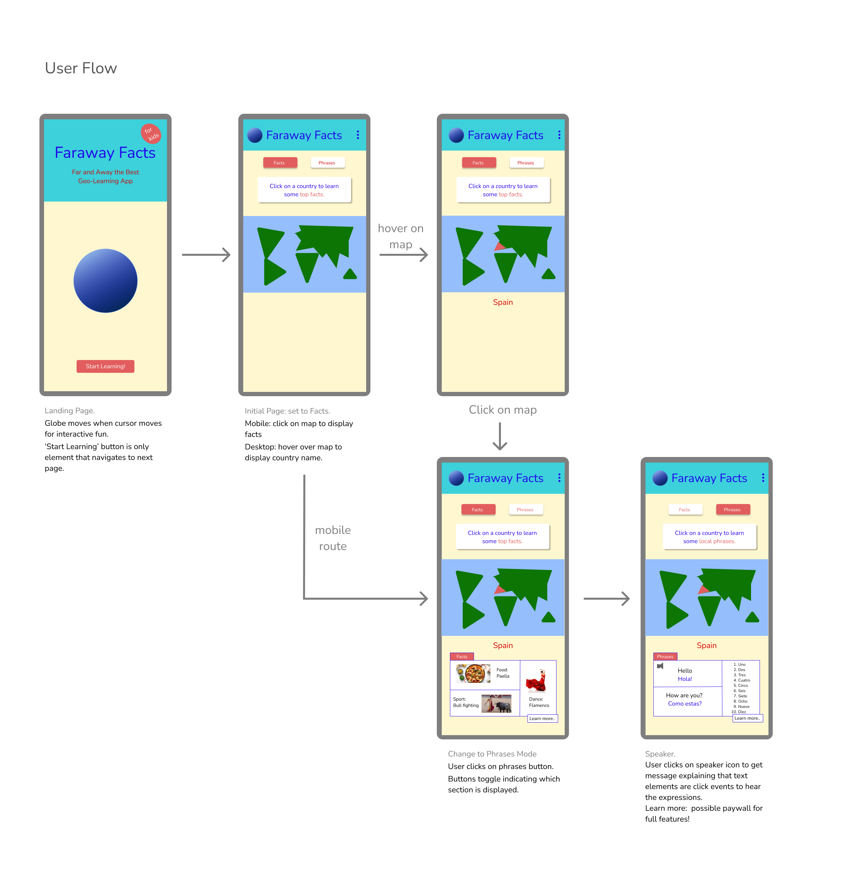

# Faraway Facts

This app displays worldwide facts when users click on countries on a map.

:no_entry: Still a Work In Progress :no_entry:

### Tools used:
* React 
* react-simple-maps
* tailwind
* and possibly TypeScript

### User Flow made in Figma:



## Quick Start
### Install Dependencies

```
npm install
```
### Run
```
npm start
```
### Author

Andrew Stratton

### Version

1.0.0
